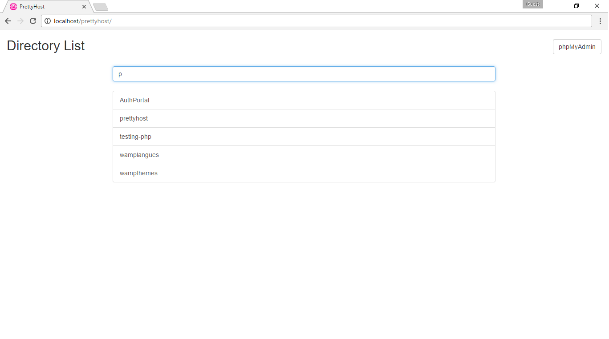

# PrettyHost

## What is it?
PrettyHost is a simple alternate to the default wamp / xampp pages.

This is built with VueJs and Bootstrap, this is a very simple app, open the source and play around with it.

## Demo Image

## Instruction
- Download [this zip](https://github.com/skadimoolam/prettyhost/archive/master.zip) file.
- Extract it to the `www` or the `htdocs` folder and rename the extracted folder to `prettyhost`
- Add `Redirect /index.html http://localhost/prettyhost/` to the `.htaccess` file
- Now remove any file that starts with `.index` or `index`, eg `.index.php`, `index.htm`
- Open `http://localhost` to test it.